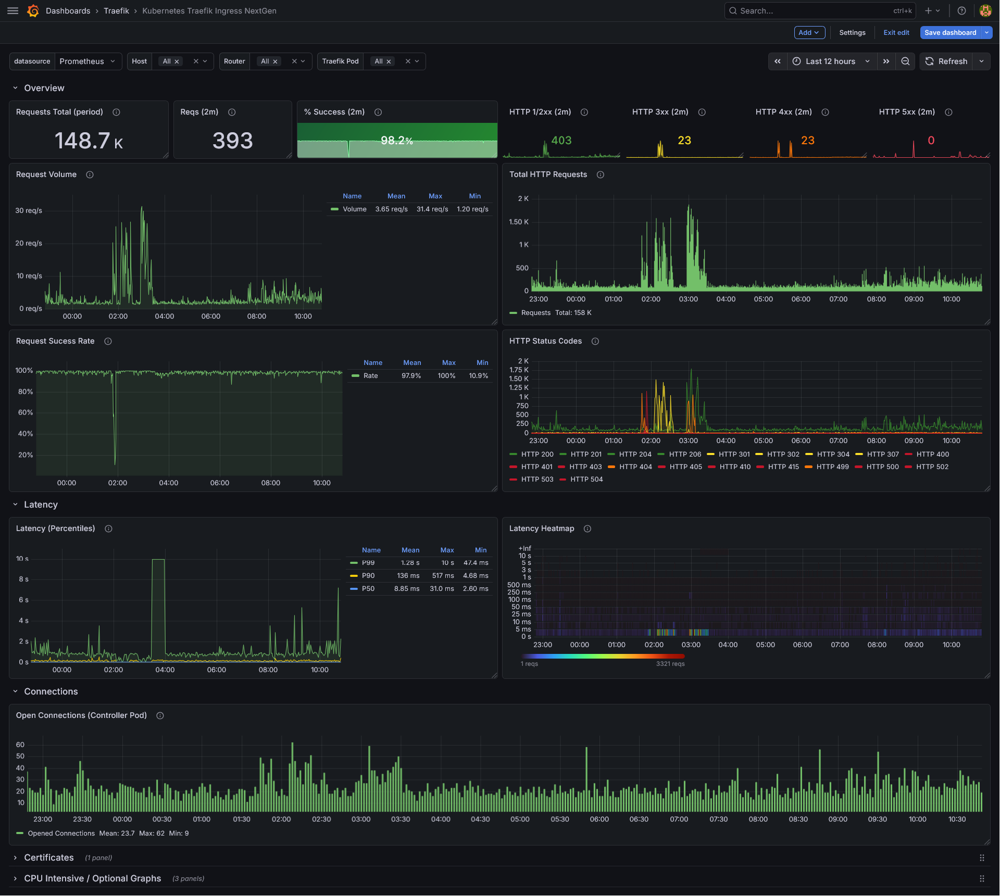
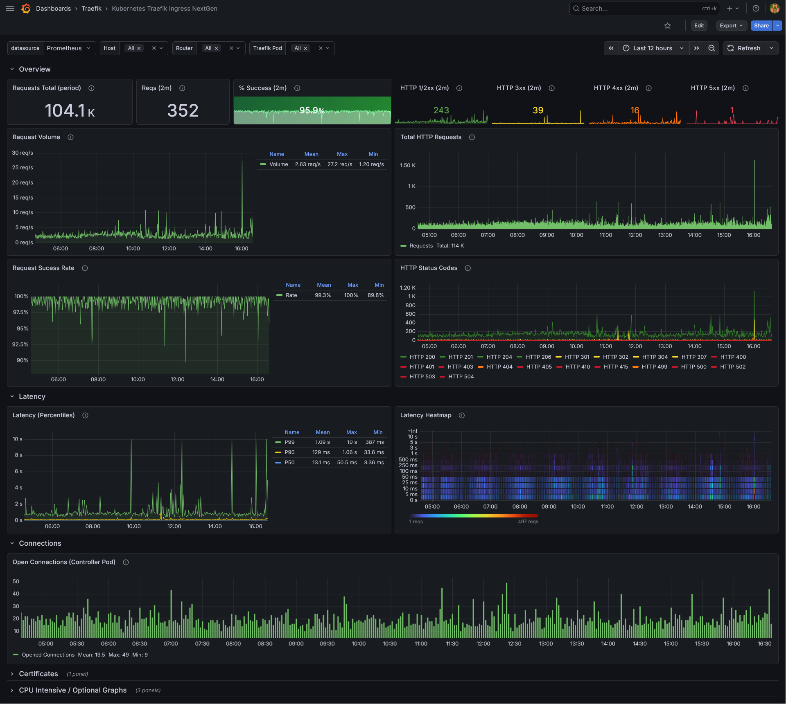

# Kubernetes Traefik Ingress NextGen <!-- omit from toc -->

[](https://grafana.com)
[](https://traefik.io)
[](https://grafana.com/grafana/dashboards/25330-kubernetes-traefik-ingress-nextgen/)

A Grafana dashboard for monitoring **Traefik Ingress Controller** via Prometheus metrics, created based on the [Kubernetes Nginx Ingress Prometheus NextGen Dashboard](https://github.com/DevOps-Nirvana/Grafana-Dashboards/tree/main) ([Grafana Link](https://grafana.com/grafana/dashboards/14314-kubernetes-nginx-ingress-controller-nextgen-devops-nirvana/)) by **DevOps-Nirvana**.




## Table of Contents <!-- omit from toc -->
- [Requirements](#requirements)
- [Features](#features)
  - [Overview Row (always visible)](#overview-row-always-visible)
  - [Latency (collapsible row)](#latency-collapsible-row)
  - [Connections (collapsible row)](#connections-collapsible-row)
  - [Certificates (collapsible row)](#certificates-collapsible-row)
  - [CPU Intensive / Optional Graphs (collapsible row)](#cpu-intensive--optional-graphs-collapsible-row)
- [Dashboard Variables](#dashboard-variables)
  - [The `scrape_interval` variable](#the-scrape_interval-variable)
- [Filters](#filters)
- [FAQ](#faq)
  - [What about a namespace/ingress/etc filter?](#what-about-a-namespaceingressetc-filter)
  - [My dashboard/filter doesn't work properly](#my-dashboardfilter-doesnt-work-properly)
- [Contributing](#contributing)
- [License](#license)


---

##  Requirements

1. This dashboard heavily uses `traefik_router_*` metrics and router related labels, which need to be enabled using the `metrics.prometheus.addRoutersLabels` in the Traefik helm chart

2. Traefik doesn't expose the Host or namespace/name of Kubernetes Ingresses as labels in its metrics ([as explained here](#what-about-a-namespaceingressetc-filter)). In order for the Host filter present in this dashboard to work, we need to inject the `host` label in our metrics, fetching from the `X-Forwarded-For` header. To do this, simply add the configuration below to your Traefik `values.yaml`:

```yaml
metrics:
  prometheus:
    headerLabels:
      host: X-Forwarded-Host
```
> **NOTE**: The reason why we use the `X-forwarded-Host` and not the `Host` header can be found [here](https://doc.traefik.io/traefik/reference/install-configuration/observability/metrics/#headerlabels) in the Traefik docs.

3. For latency panels, the bucket configuration used was the same as the ingress-nginx default configuration, which I recommend you use:

```yaml
metrics:
  prometheus:
    buckets: "0.005,0.01,0.025,0.05,0.1,0.25,0.5,1.0,2.5,5.0,10.0"
```

4. As for Grafana versions, this dashboard was created using Grafana **12.4.3**. It should work without a problem on more modern versions, but I can't guarantee it will work on really old versions since I didn't test it.


## Features

### Overview Row (always visible)

- **Requests Total (period)** — Total number of requests in the selected time range.
- **Reqs (2m)** — Number of HTTP requests in the last 2 minutes (ignores the dashboard time range).
- **% Success (2m)** — Percentage of successful (non-4xx/5xx) requests in the last 2 minutes. 404s are excluded from the denominator to avoid skewing the metric.
- **HTTP 1/2xx (2m)** — Count of successful (1xx and 2xx) responses in the last 2 minutes.
- **HTTP 3xx (2m)** — Count of redirect responses in the last 2 minutes.
- **HTTP 4xx (2m)** — Count of 4xx responses in the last 2 minutes.
- **HTTP 5xx (2m)** — Count of 5xx responses in the last 2 minutes.
- **Request Volume** — Time-series graph showing the request rate (req/s) aggregated across selected routers.
- **Total HTTP Requests** — Bar chart showing the total request count per minute.
- **Request Success Rate** — Time-series graph showing the success rate over time.
- **HTTP Status Codes** — Time-series graph breaking down requests by individual HTTP status code.

### Latency (collapsible row)

- **Latency (Percentiles)** — **P50**, **P90**, and **P99** latency.
- **Latency Heatmap** — A heatmap visualization of request latency distribution over time.

### Connections (collapsible row)

- **Open Connections (Controller Pod)** — Tracks active open connections on the selected Traefik pods. Note: this metric is pod-level only and does not support per-host/per-router filtering.

### Certificates (collapsible row)

- **Certificate Expiry** — A table listing TLS certificate hosts with their TTL (time until expiry in seconds) and expiry date. Rows show green/red thresholds based on the 21-day (1,814,400s) mark, helping you stay ahead of certificate renewals.

### CPU Intensive / Optional Graphs (collapsible row)

These panels are collapsed by default because they query with `by (router)` cardinality, which can be expensive on large clusters (can be filtered down using the filters at the top of the dashboard):

- **Latency per Router (Percentiles)** — P50/P90/P99 latency broken down per router.
- **Request Success Rate (per Router)** — Success rate split by router.
- **Request Volume (per Router)** — Request rate (req/s) split by router.

---

## Dashboard Variables

| Variable | Description | Values |
|---|---|---|
| `datasource` | Prometheus datasource to query | Any Prometheus datasource |
| `host` | Filter by ingress host | Dynamically populated from `traefik_router_requests_total`; supports multi-select |
| `router` | Filter by Traefik router name | Dynamically populated based on selected `host`; supports multi-select |
| `pod` | Filter by Traefik pod name | Dynamically populated from `traefik_config_last_reload_success`; supports multi-select |

### The `scrape_interval` variable

The `scrape_interval` is a **hidden constant** variable set to `30s` by default. It is used across multiple panels as the **minimal `$__interval`** for Prometheus queries. This ensures that Grafana does not downsample data below the actual Prometheus scrape interval, preventing misleading aggregation when the dashboard time range is very wide. If your Traefik Prometheus scrape interval differs from 30s, update this variable to match your setup.

---

## Filters

Use the dropdowns at the top of the dashboard to filter metrics:

- **Host** — Select one or more ingress hosts. The router dropdown will automatically reflect only routers associated with the selected host(s).
- **Router** — Select one or more Traefik routers.
- **Traefik Pod** — Select one or more Traefik controller pods.

Selecting `All` (the default) shows aggregate data across the entire cluster.

---

## FAQ

### What about a namespace/ingress/etc filter?

Since Traefik is agnostic, its metrics only expose labels related to its internal components, such as routers, entrypoints, and services, all following a very specific format (see below). As a result, filters for Kubernetes-specific resources like Namespaces or Ingresses cannot currently be provided unless the Traefik team adds these labels directly to the exported metrics.

Below is an example of a label set exposed by Traefik metrics:

```json
traefik_router_requests_total{code="200",container="traefik",endpoint="metrics",exported_service="monitoring-kube-prometheus-stack-grafana-service-80@kubernetes",instance="10.100.117.95:9100",job="traefik-metrics",method="GET",namespace="traefik",pod="traefik-b55586d97-xwqrv",protocol="http",router="websecure-monitoring-kube-prometheus-stack-grafana-ingress-grafana-prod-example-com@kubernetes",service="traefik-metrics"}
```

In the example above, a Grafana instance from the `kube-prometheus-stack` Helm chart is deployed with the following resources:

- Namespace name: `monitoring`
- Service name: `kube-prometheus-stack-grafana-service`
- Ingress name: `kube-prometheus-stack-grafana-ingress`
- Ingress host: `grafana.prod.example.com`

When using the Kubernetes provider, the `router` label exposes this information using the following format:

`router=[entrypoint]-[namespace]-[ingress]-[ingress-host]@kubernetes`

For the `exported_service` label, the format is this:

`exported_service=[namespace]-[service-name]-[service-port]@kubernetes`

Since dashes are used both as separators and are also valid characters within Kubernetes resource names, there is no deterministic way to distinguish whether a given dash separates two components or is simply part of a Namespace, Service, or Ingress name. As a result, reliably parsing this information is not possible.

### My dashboard/filter doesn't work properly

Make sure you've followed the steps present in the [requirements](#requirements) section. If it still doesn't work, you can [open an issue](https://github.com/GustavoJST/kubernetes-traefik-ingress-nextgen/issues/new).

## Contributing

If you spot an issue, incorrect PromQL query, or something that could be improved, please [open an issue](https://github.com/GustavoJST/kubernetes-traefik-ingress-nextgen/issues/new) to report it.

Pull requests are always welcome! Whether you're fixing a bug, adding a new panel, or improving an existing query, feel free to submit a PR.

---

## License

This dashboard is provided as-is under the [MIT License](LICENSE).
